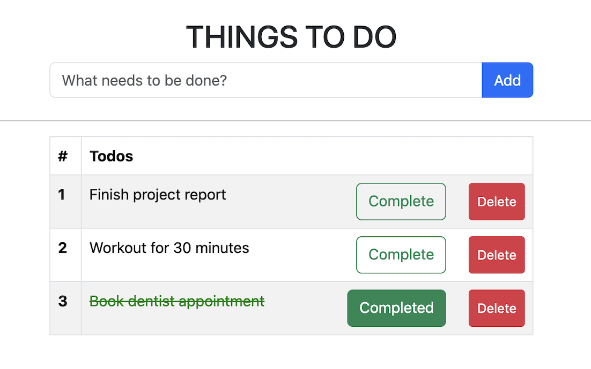

# 📝 To-Do List Project

A simple TodoList web application built with **Java (Spring Boot)**, **PostgreSQL**, **JavaScript**, **HTML**, and **Bootstrap**.

---

## 📖 Description

This project is a TodoList web application that allows users to:

- ✅ Add tasks  
- ❌ Delete tasks  
- ✔️ Mark tasks as completed  

The **backend** is developed using Java with Spring Boot and PostgreSQL.  
The **frontend** is built using HTML, Bootstrap, and JavaScript (with the Fetch API).

---

## 🖼 Screenshots

- Task List View  
- Add New Task  
- Mark as Completed  



---

## 🧰 Technologies Used

- **Backend**: Java (Spring Boot)  
- **Frontend**: HTML, JavaScript (Fetch API), Bootstrap  
- **Database**: PostgreSQL  

---

## ⚙️ Setup and Installation

### 📌 Prerequisites

- Java 8 or higher  
- PostgreSQL  
- pgAdmin (optional)  
- Maven  
- A browser & text editor (e.g., IntelliJ IDEA or VS Code)  

---

### 📥 Clone the Repository

```bash
git clone git@github.com:yasminalan/todo-app.git
```

---

### ⚙️ Configure the Backend

Edit `src/main/resources/application.yml`:

```yaml
spring:
  application:
    name: Todo-App
  datasource:
    url: jdbc:postgresql://localhost:5432/pc_todo
    username: your_user_name
    password: your_password
  jpa:
    hibernate:
      ddl-auto: update
    show-sql: true
    properties:
      hibernate:
        dialect: org.hibernate.dialect.PostgreSQLDialect
```

---

### 🗃 Create the Database

Start PostgreSQL and run:

```bash
psql -U postgres -c "CREATE DATABASE pc_todo;"
```

Or via **pgAdmin**:
1. Open pgAdmin
2. Right-click **Databases** → **Create** → **Database**
3. Name it `pc_todo` and click **Save**

> Tables will be auto-created by Spring Boot JPA.

---

### 🔨 Build and Run the Backend

```bash
mvn clean install
mvn spring-boot:run
```

The backend will run at: [http://localhost:8080](http://localhost:8080)

---

### 🌍 Launch the Frontend

Open the `todo.html` file in your browser (via VS Code or file explorer).  
The **Fetch API** connects it to the backend's REST endpoints.

---

## 🚀 Usage

- Add tasks  
- Delete tasks  
- Mark tasks as completed  

Everything is handled through the frontend UI and JavaScript Fetch calls.

---

## 🧱 Database Schema

| Field       | Type    | Description                    |
|-------------|---------|--------------------------------|
| `id`        | UUID    | Primary key, auto-generated    |
| `description` | String | Task description              |
| `completed` | Boolean | Completion status              |
